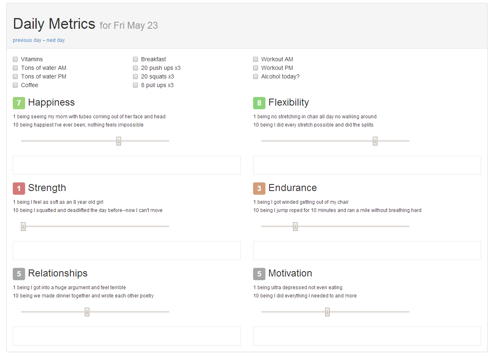

chin up
=======





### Why? ###
To become the best I can be: I need motivation, I need to get my chin up.

### How do you measure? ###
Every metric that I believe significantly effects my motivation and health will be measured on a scale from 1 to 10.
If there is something significant to note, I'll put that down as well. However, the main goal is to motivate myself through
numbers and statistics.

**1 being** the worst, least effort I could possibly put in and **10 being** the best, most effort I could possibly put in.

### When will you be... done? ###
I don't ever expect to be a 10 in all areas all the time, so there will always be room for improvement! I need/want some
motivation in my life these days. It's strange being 25 and having your whole life ahead of you. So crippling to want to
pursue Jiu Jitsu, Fishing, Programming, Gaming, Olympic Lifting, Powerlifting, Traveling, starting a family, etc. etc.

It's difficult to make a decision, especially because of my personality type always wanting to do things perfectly/the right way.
I'm hoping this helps me pursue all of those things by simply being a healthy and happy person.

### Isn't this just like a really dumbed down workout tracker? ###
Totally.

It's not meant to be for one specific goal, but all of my goals boiled down to their most basic components.

Sometimes it feels like even if I got a world record, made a million dollar idea come to fruition, or wrote some amazing
novel programming library I'd still feel unfulfilled. That's why I need to start worrying about these metrics.


Setup
=====

Setup the database environment variables
```
export DATABASE_NAME='db'
export DATABASE_USERNAME='postgres'
export DATABASE_PASSWORD=''
export DATABASE_HOST='localhost'

export PIN_PASSCODE_USERNAME='eric' # user to sign in as, defaults to "admin"
export PIN_PASSCODE_PIN=1234        # the passcode required to login as the above user, using 0-9 and #
```

Setup your timezone
```python
# settings/base.py
TIME_ZONE = 'US/Pacific'
```

Install requirements
```
pip install -r requirements.txt
```

Syncdb and migrate
```
python manage.py syncdb --migrate
```

Test it out
```
python manage.py runserver
```

Then go to `http://localhost:8000/admin/` and add daily/monthly tracking items.


Stats
=====


 * **Month to month** - Average for the entire month
 * **Week to week** - Average for the entire week
 * **Day of the week** - Average for that day of the week for the last year
 * **7 day** - Last 7 day simple
 * **30 day** - Last 30 day simple


Correlations
============

Thanks to numpy I added really quick correlations between metrics, it's pretty ugly but it will tell you what metrics
might positively/negatively correlate to each other.


Easy login
==========

<p align="center" class="image-wrapper"></p>

To make Chin Up easier to use, I made a simple app and threw it on pypi called [django-pin-passcode](https://github.com/ckcollab/django-pin-passcode).
It logs you in to the user you define after you enter a certain passcode composed of 0-9 and #.


Example tracking items
======================

If you want the same setup I have, go to the `admin` screen and add these items.

### Daily checklist (binary=True)
- Vitamins
- Coffee
- 20 pushups for 3 sets
- 20 squats for 3 sets
- (a lot more, this depends entirely on what you do/want to do every day)

### Daily tracking
- Happy
    * 1 being seeing my mom with tubes coming out of her face and head
    * 10 being happiest I've ever been, nothing feels impossible
- Motivated
    * 1 being ultra depressed not even eating
    * 10 being I did everything I needed to and more
- Flexibility
    * 1 being no stretching in chair all day no walking around
    * 10 being I did every stretch possible and did the splits
- Strength
    * 1 being I feel as soft as an 8 year old girl
    * 10 being I squatted and deadlifted the day before--now I can't move
- Endurance
    * 1 being I got winded getting out of my chair
    * 10 being I jump roped for 10 minutes and ran a mile without breathing hard
- Relationship
    * 1 being I got into a huge argument and feel terrible
    * 10 being we made dinner together and wrote each other poetry

### Monthly tracking
- Life goals
    * 1 being no progress towards goals and very depressed
    * 10 being I got a world record deadlift
- Power
    * 1 being no physical activity
    * 10 being I ran and worked out every opportunity I had
- Nature
    * 1 being no outdoor activity
    * 10 being I spent the entire time camping and fishing


Acknowledgements
================

I got this idea from [Steven Skoczen](https://github.com/skoczen)
